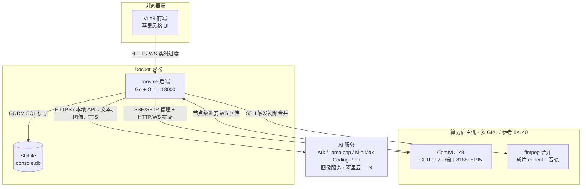
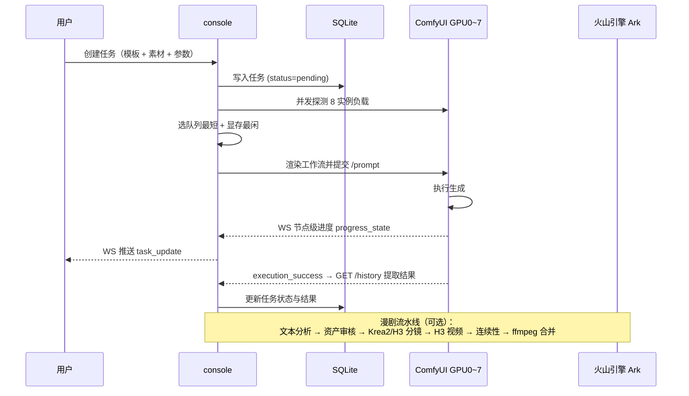

<p align="center">
  <a href="https://hequan2017.github.io/new-aigc-comfyui-minimax-h3/"><strong>🌐 在线预览前端</strong></a>
  ·
  <a href="https://github.com/hequan2017/new-aigc-comfyui-minimax-h3/actions/workflows/deploy-pages.yml">查看构建状态</a>
</p>

# ComfyStudio · ComfyUI 多卡管理控制平台

[](LICENSE)
[](backend/go.mod)
[](frontend/package.json)

ComfyStudio 是一个基于 **Go + Vue3** 的 ComfyUI 多卡生成平台与 AI 漫剧制作工作台。平台支持可配置数量的本地或远程 GPU（参考部署为 **8×NVIDIA L40**），内置 MiniMax H3 与 Krea2 工作流，自动把任务调度到最空闲的实例，并实时展示节点进度、显卡占用和生成结果。

漫剧工作台支持两条创作路径：**故事梗概创作**，以及 **长篇小说导入与改编**。完整流程覆盖「文本分析 → 创作方案 / Story Bible → 角色与视觉资产审核 → 分镜与导演镜头 → 分镜图 → H3 视频 → 连续性选帧 → 配音字幕 → 剪辑合并」，强调人工审核、参考图绑定、提示词可编辑和跨镜头一致性，而不是直接黑盒生成。

---

## 界面预览

<p align="center">
  
  
  <br/>
  
  
  <br/>
  
  
  <br/>
  
</p>

---

## 目录

- [界面预览](#界面预览)
- [核心特性](#核心特性)
- [系统架构](#系统架构)
- [功能清单](#功能清单)
- [技术栈](#技术栈)
- [部署指南](#部署指南)
- [配置说明](#配置说明)
- [项目结构](#项目结构)
- [API 摘要](#api-摘要)
- [测试验证](#测试验证)
- [已知问题](#已知问题)
- [开源协议](#开源协议)

---

## 核心特性

| 能力 | 说明 |
|---|---|
| 多卡调度 | GPU 数量可配置；参考部署为 8×L40，任务自动分配到**队列最短 + 显存最闲**的实例 |
| 实时进度 | WS 推送 ComfyUI 0.30+ 节点级进度（`progress_state`），生成中封顶 99% |
| MiniMax H3 | T2VA / I2VA / FL2VA / Ref2VA 分离编译，支持多参考、首尾帧和完整提示词人工审核 |
| 任务恢复 | 平台/实例重启后自动 reconcile 卡死任务，history 丢失时按任务 ID 兜底恢复结果 |
| 远程算力 | SSH/SFTP 管理远程 ComfyUI 节点（实例启停、素材上传、结果读取） |
| 视频元数据 | 纯手写解析 MP4/图片（分辨率/时长/大小/编码），不依赖 ffprobe |
| 漫剧工作台 | 梗概或长篇小说 → 分析/方案 → 资产审核 → 分镜图 → H3 视频 → 连续性 → 剪辑成片 |
| 角色与造型资产 | 结构化角色档案、审核、标准像、四视图、独立 CharacterLook 与可组合 CharacterOutfit |
| 道具/场景资产 | 关键道具与主要场景自动建卡 + 参考图（生成或上传），分镜画面按 location/props 注入参考图锁定外观 |
| 角色音色绑定 | 角色级预设音色，或上传 10~20 秒参考语音复刻音色（qwen-voice-enrollment），全剧配音一致 |
| TTS 配音 | 阿里云 Qwen TTS / 音色复刻，支持对白编辑、重配音与 SRT 字幕 |
| 视频连续性 | 从上一镜末尾提取 22 帧候选，人工选帧或替换，并支持独立、续接和首尾桥接模式 |
| Skill 与提示词 | 版本化系统/自定义 Skill、项目级启停、提示词预览、历史、回滚与审计 |
| 模拟模式 | `simulate: true` 时按模板参考耗时模拟进度，无需 GPU 即可体验基础任务流程 |

---

## 系统架构



### 组件说明

| 组件 | 类型 | 职责 |
|---|---|---|
| 浏览器前端 | Vue3 + Vite | Dashboard / 任务创建 / 任务详情 / 实例管理 / GPU 看板 / 漫剧工作台 / 平台设置，WS 实时刷新 |
| console 后端 | Go + Gin | 任务调度、模板渲染、ComfyUI 通信、GPU 监控、实例管理、漫剧流水线、平台设置（单二进制，前端 embed） |
| SQLite | GORM | 任务、模板、项目、章节、Story Bible、场景/镜头、角色/造型、Skill、连续性与设置持久化 |
| ComfyUI 多实例 | 本地 / SSH / Docker | MiniMax H3 视频、Krea2 人物/资产/分镜图生成；参考部署每卡一实例 |
| ffmpeg | 远程命令 | 按场景顺序 concat 拼接成片并保留音轨（libx264/AAC） |
| AI 服务 | 云 API / 本地模型 | 文本模型支持 Ark、llama.cpp、MiniMax Coding Plan；图像模型可配置；配音使用阿里云 Qwen TTS |

### 任务执行数据流



---

## 功能清单

### 平台基础

- [x] **实例管理**：启动/停止/重启单实例（SSH 调用 `start-multi-gpu.sh`）、一键启停全部、一键重启全部（异步执行）
- [x] **GPU 看板**：8 卡温度/功耗/显存/利用率/进程实时监控
- [x] **工作流模板**：4 个 MiniMax H3 模板（t2v / i2v / 首尾帧 / 参考视频），占位符渲染 + 复数素材展开 + 自动节点裁剪
- [x] **任务创建**：模板选择 → 素材上传（图片/视频/音频）→ 参数配置（分辨率预设/时长/步数/种子/CFG/帧率）
- [x] **自动调度**：并发探测实例负载，提交到最空闲 GPU（队列短优先，显存大次之）
- [x] **实时进度**：WS 推送节点级进度，生成中封顶 99%
- [x] **结果展示**：在线预览（HTTP Range 拖动）+ 下载，元数据纯手写解析
- [x] **任务管理**：列表筛选 / 取消 / 重试 / 详情回看 / 清空已结束任务
- [x] **任务自动恢复**：后台循环（30s）扫描 `running`/`queued` 卡死任务并 reconcile；history 丢失时从 `output_workers/gpuN/` 兜底恢复
- [x] **平台设置**：火山引擎 Ark API Key / 模型 ID / 画面尺寸，支持测试连通性（API Key 打码回显）

### AI 漫剧工作台

- [x] **双入口创作**：支持故事梗概生成，也支持 TXT/Markdown 长篇小说导入、章节识别、拆分、合并与重排
- [x] **长篇改编流水线**：章节分析 → 5~10 章故事弧 → 别名审核 → Story Bible 人工批准 → 改编策略 → 分集剧本 → 连续性审查；任务可恢复
- [x] **单集预算**：默认约 180 秒、25 个镜头，分集目标可编辑；单镜时长 3~15 秒，剪辑台显示累计进度
- [x] **角色档案审核**：故事生成后由 LLM 自动抽取完整角色草稿，支持编辑、批准、驳回和重新生成；变更会使下游资产失效
- [x] **标准像与四视图**：Krea2 生成角色大头标准像和四视图；标准像提示词保持简洁，不混入多套服装、负面词或冗长设定
- [x] **独立造型与套装**：CharacterLook 管理服装、鞋履、发型/发饰、首饰、包等单件资产；CharacterOutfit 将已审核资产组合为套装，可按场景选择、按镜头覆盖
- [x] **道具与场景资产**：武器、法宝和剧情物品继续作为 `prop`；主要地点作为 `location`，均可生成/上传参考图并跨镜头复用
- [x] **人物用途分类**：区分画面可见、仅发声、仅提及；只有明确可见人物缺少参考图时才阻塞分镜生成
- [x] **导演镜头层**：Scene 下可编辑 Shot 的幕结构、景别、机位、运镜、时长、动作、情绪、对白和五段导演提示词
- [x] **H3 分镜图**：SelfLift 按最终上传顺序绑定 `<Picture N>` / `<Subject N>`，只描述单一静态起始画面
- [x] **H3 视频协议**：T2VA/I2VA/FL2VA 使用关键帧三字段协议，Ref2VA 使用六段协议；对白、旁白、内心独白保留原文
- [x] **视频提示词审核**：GPU 提交前可 AI 重新生成、直接编辑、保存并预览完整提示词；剧情、人物或参考图变化后标记旧提示词失效
- [x] **视频连续性**：从上一镜末尾提取 22 帧供人工选择/替换，支持独立生成、上一镜续接、上一镜尾帧到当前分镜图的首尾桥接
- [x] **参考图治理**：人物、造型、场景、道具有序绑定；最多 9 张，超限时显示候选数、提交数和取舍优先级
- [x] **受限 Skill 框架**：系统/自定义 Skill 版本管理、项目级启停、提示词装配和审计；Skill 不具备网络、Shell、文件或数据库执行权限
- [x] **可配置文本模型**：支持火山 Ark、本地 llama.cpp 与 MiniMax Coding Plan，生成路径通过统一 TextProvider 解析
- [x] **角色音色与字幕**：阿里云 Qwen 音色复刻/合成，支持对白编辑与重新配音，并生成 UTF-8 BOM SRT
- [x] **剪辑与合并**：剪辑台预览分镜图和场景视频、调整时长与顺序，最终由 ffmpeg 合并并保留音轨

---

## 技术栈

| 端 | 技术 |
|---|---|
| 后端 | Go 1.25 + Gin + GORM(SQLite) + gorilla/websocket + pkg/sftp |
| 前端 | Vue3 + Vite + Pinia + Vue Router（苹果风格设计系统，无 UI 库，黑白主题切换） |
| 数据库 | SQLite（`/opt/comfyui-console/data/console.db`） |
| 推理 | ComfyUI（MiniMax H3 + Krea2，多实例；参考部署 8×NVIDIA L40） |
| AI 服务 | 文本：Ark / llama.cpp / MiniMax Coding Plan；图像：可配置云模型 + 本地 Krea2；语音：阿里云 Qwen TTS |
| 部署 | 单二进制（前端 embed），Docker / 裸进程两种方式 |

---

## 部署指南

### 部署架构（两种形态）

| 形态 | 说明 | 适用 |
|---|---|---|
| **console 容器 + ComfyUI 裸进程**（默认） | console 跑 Docker 容器（前端 embed + Go 单二进制 + SQLite），多个 ComfyUI 实例为**宿主机裸进程**（`start-multi-gpu.sh` 管理），console 经 **SSH** 启停实例、经 **SFTP** 读写素材/结果 | 生产（推荐；8×L40 为已验证参考配置） |
| **全容器（compose 管理 ComfyUI）** | `comfy.mode: docker`，console 经 SSH 在宿主执行 `docker compose` 管理 `comfyui-gpu{N}` 容器（CDI 绑卡，共享挂载 models） | 容器化隔离需求 |
| **本地模式** | `comfy.mode: local`，ComfyUI 与本机 console 同机裸进程，`remote.host` 留空 | 单机开发测试 |

### 在线预览（GitHub Pages 一键部署）

本仓库内置 GitHub Actions 工作流（`.github/workflows/deploy-pages.yml`）：**推送到 `main` 后自动执行前端测试 → `vite build` → 发布静态站点到 GitHub Pages**，全程使用内置 `GITHUB_TOKEN` 部署，**无需配置任何仓库 Secret**。

- 访问地址：[https://hequan2017.github.io/new-aigc-comfyui-minimax-h3/](https://hequan2017.github.io/new-aigc-comfyui-minimax-h3/)
- 首次部署前需一次性放开 Token 权限：仓库 **Settings → Actions → General → Workflow permissions** 选 **Read and write permissions**，之后工作流会用 `GITHUB_TOKEN` 自动开启 Pages 并设 Source 为 GitHub Actions；若不想放开权限，也可在 **Settings → Pages** 手动将 Source 设为 **GitHub Actions**，再 Re-run 工作流
- 构建时自动注入子路径 base（`--base=/<仓库名>/`），静态预览使用 Hash 路由，刷新子页面不会出现 404，fork 改名后依然可用
- Pages 版本会显示“静态预览”状态且不会反复连接 WebSocket；`/api` 请求在 Pages 上无后端响应，完整功能请按下方步骤本地部署

### 组件清单

| 组件 | 作用 | 部署位置 | 获取方式 |
|---|---|---|---|
| **console**（Go 后端 + Vue3 前端 embed） | 任务调度 / GPU 监控 / 实例管理 / 漫剧流水线 / 设置 | Docker 容器 `console`（:18000） | 本仓库构建（Dockerfile） |
| **SQLite** | 任务 / 模板 / 项目 / 设置持久化 | `data/console.db`（volume 挂载） | console 启动时自动迁移建表 |
| **ComfyUI ×8** | MiniMax H3 推理（t2v/i2v/首尾帧/ref2v），每卡一实例 | 宿主机 `/opt/comfyUI`（裸进程，端口 8188~8195） | 本仓库 `comfyui/` 目录（含 MiniMax H3 实现） |
| **conda 环境 `comfyenv`** | ComfyUI 运行依赖（torch 等，镜像内不装，复用宿主） | 宿主机 `/opt/miniconda3/envs/comfyenv` | `deploy.sh` 自动增量 `pip install -r comfyui/requirements.txt`（幂等） |
| **MiniMax H3 模型权重** | DiT 模型 ×2 + Qwen3-VL 文本编码器 + 视频/音频 VAE（共 5 个文件） | 宿主机 `/opt/comfyUI/models/` 下对应子目录（见「H3 模型部署」） | 手动下载放置 |
| **start-multi-gpu.sh** | 宿主机多卡实例启停脚本（start/stop/restart/status） | 宿主机 `/opt/comfyUI/start-multi-gpu.sh` | 仓库 `shell/start-multi-gpu.sh`（部署前按实际路径/卡数修改） |
| **SSH 凭证** | console → 宿主机 免密管理（私钥优先于密码） | `config.yaml` 的 `remote` 段 + `/opt/comfyui-console/ssh_key` | 自行生成/配置 |
| **AI 服务凭证** | 文本、图像、阿里云 TTS 与音色复刻 | 平台设置页（存 SQLite，敏感值打码回显） | 对应服务控制台申请 |
| **NVIDIA 驱动 + nvidia-container-toolkit** | GPU 监控（nvidia-smi）+ 容器 GPU 访问（CDI） | 宿主机 | 官方驱动 + `nvidia-ctk cdi generate` |
| **Docker + compose v2** | console 容器运行 | 宿主机 | 官方安装脚本 |

### 环境要求

- **算力服务器**：Linux + NVIDIA GPU（`comfy.gpu_count` 可调，默认 8）
- **Docker** + docker compose v2（仅 console 容器需要）
- **conda**（miniconda3）与 ComfyUI 依赖环境 `comfyenv`
- **MiniMax H3 模型权重**（必须，否则任务无法推理）
- **网络**：可访问 Docker Hub 镜像加速（脚本默认 daocloud / npmmirror / goproxy.cn 中国源）

### 部署步骤

#### 1. 下载代码

```bash
git clone https://github.com/hequan2017/new-aigc-comfyui-minimax-h3.git
cd new-aigc-comfyui-minimax-h3
```

#### 2. 准备 conda 环境

```bash
# 创建 conda 环境（如已存在可跳过，deploy.sh 会自动增量安装缺失依赖）
conda create -n comfyenv python=3.11 -y
```

依赖安装由 `deploy.sh` 自动完成（`pip install -r comfyui/requirements.txt -i https://pypi.tuna.tsinghua.edu.cn/simple`）。

#### 3. 部署 ComfyUI

将 `comfyui/` 目录部署为 `/opt/comfyUI`：

```bash
mkdir -p /opt/comfyUI
cp -r comfyui/* /opt/comfyUI/
```

**依赖安装**：ComfyUI 依赖（`requirements.txt`：torch / torchaudio / transformers / comfy-kitchen 等）安装到 conda 环境 `comfyenv`，由 `deploy.sh` 自动增量安装（幂等）：

```bash
# 也可手动安装
/opt/miniconda3/envs/comfyenv/bin/python -m pip install -r comfyui/requirements.txt -i https://pypi.tuna.tsinghua.edu.cn/simple
```

**目录结构**（`comfy_dir` 必须与 `config.yaml` 的 `comfy.comfy_dir` 一致）：

```
/opt/comfyUI/
├── main.py                   # 入口（复用宿主 conda python）
├── comfy/                    # 核心（含 ldm/minimax/ 与 text_encoders/minimax.py）
├── comfy_extras/
│   └── nodes_minimax_h3.py   # H3 节点：EmptyLatentAV / ImageToVideo / ReferenceToVideo / SigmaShift
├── models/                   # 模型权重（见下）
├── start-multi-gpu.sh        # 多卡实例启停脚本（仓库 shell/ 提供，console 经 SSH 调用）
└── input/ output/ temp/      # 运行数据目录（8 实例共享 input，独立 output_workers/gpuN）
```

> `extra_model_paths.yaml`（可选）：如需把模型放在其他盘符/目录，可复制 `extra_model_paths.yaml.example` 配置 `base_path` 指到大容量磁盘，避免占用系统盘。

#### 4. MiniMax H3 模型部署

平台共需 **5 个权重文件**（工作流模板按以下文件名加载，缺一不可）：

| 权重文件 | 放置目录 | 加载器 | 用途 |
|---|---|---|---|
| `minimax_h3_fl2va_bf16.safetensors` | `models/diffusion_models/` | UNETLoader（fp8_e4m3fn） | 文生视频 / 图生视频 / 首尾帧 DiT |
| `minimax_h3_ref2va_bf16.safetensors` | `models/diffusion_models/` | UNETLoader（fp8_e4m3fn） | 参考视频（ref2v）DiT |
| `qwen3vl_32b_minimax_h3_bf16.safetensors` | `models/text_encoders/` | CLIPLoader（type=minimax） | Qwen3-VL-32B 文本/视觉编码器（截断 50 层） |
| `minimax_h3_video_vae_fp16.safetensors` | `models/vae/` | VAELoader | 视频 VAE（图像/视频编解码） |
| `minimax_h3_audio_vae_fp32.safetensors` | `models/vae/` | VAELoader | 音频 VAE（音轨编解码，32kHz） |

```bash
mkdir -p /opt/comfyUI/models/{diffusion_models,text_encoders,vae}
# 将 5 个权重文件放入对应目录（文件名严格一致，fp8 权重加载时自动量化）
```

**模型说明**：

- **H3 是联合视频+音频生成模型**：一次采样同时产出视频与音轨（音画同步），无需外部 TTS；`Empty MiniMax H3 AV Latent` 创建 24fps 视频 + 40fps 音频联合隐空间
- **时长网格**：帧数对齐 `17k+5` 网格（124 帧 ≈ 5 秒），训练范围为 124~362 帧（5~15 秒），更长未测试
- **画布约束**：短边 768px、面积上限 768×1344，宽高按 32px 对齐；ref2v 参考图短边最大 2048px
- **ref2v 参考类型**：参考图（最多 9 张）/ 参考视频（最多 3 个，2~15 秒，24fps）/ 参考音频（最多 3 段），提示词用 `<Picture i>` / `<Video k>` / `<Audio j>` 标签引用
- **采样参数**：euler + simple，`MiniMaxH3SigmaShift` 设置 video shift 12.0 / audio shift 3.0（本平台模板已内置）
- **显存**：fp8 量化加载下单实例约需 **22~24GB 显存**（8×L40 96GB 可并行 8 实例），`comfy.reserve_vram` 控制每实例预留

**工作流模板与模型映射**（`backend/internal/service/templates/`，启动时种子化进 SQLite）：

| 模板 | code | 使用的 DiT | 必填素材 |
|---|---|---|---|
| 文生视频 | `minimax_h3_t2v` | `fl2va` | 无 |
| 图生视频 | `minimax_h3_i2v` | `fl2va` | 首帧图 |
| 首尾帧视频 | `minimax_h3_first_last` | `fl2va` | 首帧 + 尾帧图 |
| 参考视频 | `minimax_h3_ref2v` | `ref2va` | 提示词（参考图/视频/音频可选） |

> 验证模型就绪：`cd /opt/comfyUI && bash start-multi-gpu.sh start` 后访问 `http://<节点IP>:8188/system_stats`；或平台创建 t2v 任务，观察节点级进度推进。

#### 5. 部署多卡启动脚本

宿主机 `/opt/comfyUI/` 下需要 `start-multi-gpu.sh`（管理 N 个实例：每卡一个裸进程，端口 8188~8195，`--reserve-vram 6`，仅 GPU0 启用 Manager）。console 的实例管理/一键启停功能通过 SSH 调用它。

仓库已内置该脚本（`shell/start-multi-gpu.sh`），部署到宿主机：

```bash
scp shell/start-multi-gpu.sh root@<服务器IP>:/opt/comfyUI/start-multi-gpu.sh
ssh root@<服务器IP> "chmod +x /opt/comfyUI/start-multi-gpu.sh"
```

> 部署前按实际环境修改脚本头部：`COMFY_DIR` / `CONDA_SH` / `GPU_COUNT` / `RESERVE_VRAM`（脚本默认 `/opt/comfyUI` + 8 卡 + 预留 6GB，与仓库脱敏约定一致）。

#### 6. 生成配置

```bash
cp backend/config.yaml.example backend/config.yaml
```

编辑 `backend/config.yaml`：

```yaml
remote:
  host: "<算力节点IP>"        # SSH 地址（remote.host 为空时按本地模式运行）
  port: 22
  user: root
  password: ""              # 推荐改用私钥
  private_key: "/opt/comfyui-console/ssh_key"
comfy:
  comfy_dir: /opt/comfyUI   # 与宿主机实际目录一致
simulate: false
```

#### 7. 一键部署（Docker 容器）

```bash
bash deploy.sh               # git pull → conda 依赖 → 构建镜像 → 启动 → 健康检查
bash deploy.sh --no-gpu      # 无 GPU / 未装 toolkit 时
bash deploy.sh --rebuild     # 强制重建镜像（默认每次发版已强制重建）
```

`deploy.sh` 自动完成：

1. `git pull` 更新代码（更新后自动重新加载脚本继续）
2. 清理旧部署（旧 console 进程 / 残留容器）
3. 检查 Docker / CDI / GPU 环境
4. 准备宿主机目录与 `config.yaml`（首次自动从模板复制）
5. conda 环境增量安装 ComfyUI 依赖
6. 构建 `comfyui:latest` 与 `comfyui-console:latest` 镜像（构建后 `docker save` 备份到 `/opt/docker-images/`）
7. `docker compose up -d` 启动 console
8. 健康检查：平台 `/api/health` + 8 个 ComfyUI 实例 `/system_stats`

部署完成后浏览器访问 `http://<服务器IP>:18000`。

#### 8. 验证部署

```bash
# 平台健康
curl http://127.0.0.1:18000/api/health

# ComfyUI 实例（宿主机裸进程）
cd /opt/comfyUI && bash start-multi-gpu.sh status

# 浏览器
# 总览页确认 8 卡 GPU 看板在线 → 创建任务 → 观察节点级进度 → 预览生成视频
```

### 传统二进制部署（备用，无 Docker）

```bash
# ① 本地交叉编译（Linux 开发机）
cd backend
CGO_ENABLED=0 GOOS=linux GOARCH=amd64 go build -ldflags="-s -w" -o console-linux-amd64 .

# ② 上传并启动（backend/deploy.sh 亦可一键完成）
scp console-linux-amd64 config.yaml root@<server>:/opt/comfyui-console/
ssh root@<server> "cd /opt/comfyui-console && bash -c 'nohup ./console-linux-amd64 > console.log 2>&1 &'"
```

### 模拟模式（无 GPU 体验）

将 `config.yaml` 的 `simulate` 设为 `true`，任务按模板参考耗时模拟进度推进直至成功，不连接 ComfyUI——可用于本地开发验证前端全流程。

### 运维与升级

| 操作 | 命令 |
|---|---|
| 升级发版 | 服务器仓库 `bash deploy.sh`（每次强制重建镜像，前端/后端代码总是最新） |
| 查看日志 | `docker logs -f console` |
| 重启平台 | `docker restart console` |
| ComfyUI 实例 | `cd /opt/comfyUI && bash start-multi-gpu.sh {status\|restart\|stop}` |
| 数据备份 | 备份 `/opt/comfyui-console/data/`（SQLite + 上传素材）即可 |
| 镜像缓存 | 构建产物自动 `docker save` 到 `/opt/docker-images/`，下次部署秒级 load |

---

## 配置说明

`backend/config.yaml.example` 为配置模板，复制为 `config.yaml` 后填写真实值（**切勿提交含密钥的 config.yaml**）：

| 配置项 | 默认值 | 说明 |
|---|---|---|
| `server.addr` | `0.0.0.0:18000` | 平台监听地址 |
| `comfy.comfy_dir` | `/opt/comfyUI` | ComfyUI 目录 |
| `comfy.base_port` | `8188` | 实例起始端口（每 GPU 递增 1） |
| `comfy.gpu_count` | `8` | GPU 实例数量 |
| `comfy.reserve_vram` | `6` | 每实例预留显存（GB） |
| `comfy.force_fp16` | `true` | 强制 FP16 |
| `comfy.enable_manager` | `true` | 仅 GPU0 启用 ComfyUI Manager |
| `comfy.mode` | `ssh` | 调度方式：`ssh`（算力节点裸进程）/ `docker`（compose 容器）/ `local`（本机裸进程） |
| `comfy.container_prefix` | `comfyui-gpu` | docker 模式容器名前缀 |
| `comfy.network` | `comfyui-console_default` | docker 模式容器网络 |
| `storage.db_path` | `/opt/comfyui-console/data/console.db` | SQLite 数据库路径 |
| `storage.data_dir` | `/opt/comfyui-console/data` | 数据目录 |
| `gpu.nvidia_smi` | `/usr/bin/nvidia-smi` | nvidia-smi 路径 |
| `gpu.monitor_interval_seconds` | `3` | GPU 监控采集间隔 |
| `remote.host` | 空 | SSH 算力节点地址（为空则本地模式） |
| `remote.port` | `22` | SSH 端口 |
| `remote.user` | `root` | SSH 用户 |
| `remote.password` | 空 | SSH 密码（推荐改用私钥） |
| `remote.private_key` | 空 | SSH 私钥路径（优先于 password） |
| `simulate` | `false` | 模拟模式（无 GPU 验证全流程） |

---

## 项目结构

```
├── backend/                       # Go 后端
│   ├── main.go                    # 入口：config → db → service → router
│   ├── config.yaml.example        # 配置模板（复制为 config.yaml 填写真实值）
│   ├── internal/
│   │   ├── api/router.go          # 路由
│   │   ├── config/                # 配置加载
│   │   ├── database/              # SQLite 初始化 + 自动迁移
│   │   ├── models/                # 任务、项目、小说、角色/造型、镜头、Skill、连续性等模型
│   │   ├── service/
│   │   │   ├── handlers.go        # API Handlers（ClearTasks / Output / MediaInfo / WS）
│   │   │   ├── task_service.go    # 任务创建/调度/渲染/WS进度/simulate
│   │   │   ├── project_service.go # 漫剧项目：剧本/分镜/H3视频/合并 + 状态轮询
│   │   │   ├── novel_*            # 小说导入、章节分析、Story Bible 与改编服务
│   │   │   ├── character_*        # 角色档案、造型与套装审核/生成
│   │   │   ├── continuity_*       # 视频尾帧候选、选帧、桥接与失效传播
│   │   │   ├── skill_service.go   # 受限 Skill 版本、项目配置与审计
│   │   │   ├── text_provider.go   # Ark / llama.cpp / MiniMax Coding Plan 统一文本接口
│   │   │   ├── project_handlers.go# 漫剧项目与平台设置 Handlers
│   │   │   ├── volc_engine.go     # 火山引擎 Ark 客户端
│   │   │   ├── comfy_client.go    # ComfyUI HTTP 客户端 (prompt/queue/history)
│   │   │   ├── ws_client.go       # ComfyUI WS 监听 + 前端推送 Hub
│   │   │   ├── instance_manager.go# 实例启停（SSH 调 start-multi-gpu.sh）
│   │   │   ├── gpu_monitor.go     # nvidia-smi 采集
│   │   │   ├── remote.go          # SSH/SFTP 远程执行
│   │   │   ├── media_probe.go     # MP4/图片 元数据解析
│   │   │   ├── template_seed.go   # 系统模板种子化 + 素材上传管理
│   │   │   └── templates/         # 通用 H3 + 漫剧专用 H3/Krea2 工作流 JSON（embed，可运行时覆盖）
│   │   └── static/dist            # 前端构建产物 (embed)
│   └── deploy.sh                  # 传统二进制部署脚本
├── comfyui/                       # ComfyUI fork 代码（含 MiniMax H3 模型实现）
├── frontend/                      # Vue3 前端
│   └── src/
│       ├── views/                 # 项目/小说/Story Bible/改编/剪辑/造型/Skill/素材/任务等
│       ├── styles/main.css        # 苹果风格设计系统（黑白主题）
│       ├── api/index.js           # API + WS 客户端
│       └── stores/app.js
├── Dockerfile                     # console 镜像（前端 embed + Go 单二进制）
├── docker-compose.yml             # console 容器（comfyui 为宿主机裸进程）
├── shell/start-multi-gpu.sh       # ComfyUI 多卡实例启停脚本（部署到宿主机使用）
└── deploy.sh                      # 一键部署（git pull → conda → 镜像 → 启动 → 健康检查）
```

---

## API 摘要

### 平台基础

| 方法 | 路径 | 说明 |
|---|---|---|
| GET | `/api/health` | 健康检查 |
| GET | `/api/instances` | 实例列表（状态/队列/显存，自动探测真实状态） |
| POST | `/api/instances/:id/start · stop · restart` | 实例启停（id=GPU序号，SSH 调 start-multi-gpu.sh） |
| POST | `/api/instances/start-all · stop-all · restart-all` | 一键启停 / 重启全部（异步） |
| GET | `/api/gpus` | GPU 实时状态 |
| GET | `/api/templates` | 通用 H3 与漫剧专用 H3/Krea2 工作流模板 |
| GET | `/api/tasks · /api/tasks/:id` | 任务列表（分页/筛选）/ 详情 |
| POST | `/api/tasks` | 创建任务（提交后自动调度执行） |
| DELETE | `/api/tasks` | 清空已结束任务（存在活动任务时拒绝） |
| POST | `/api/tasks/:id/cancel · rerun` | 取消 / 重试 |
| POST | `/api/upload` | 素材上传 (multipart: file/type/task_id) |
| GET | `/api/output/:gpu/*path` | 结果文件（视频/音频，支持 Range/MIME/下载） |
| GET | `/api/media/:gpu/*path` | 输出文件元数据（分辨率/时长/大小/编码） |
| GET | `/api/input/:taskid/*path` | ComfyUI input 目录文件（分镜画面预览） |
| WS | `/api/ws` | 实时推送（实例/GPU快照、任务进度） |

### 平台设置与模型提供方

| 方法 | 路径 | 说明 |
|---|---|---|
| GET | `/api/settings` | 读取设置（API Key 打码） |
| PUT | `/api/settings` | 保存设置（API Key/接口地址/模型/画面尺寸） |
| POST | `/api/settings/test-text · test-image` | 测试当前文本 / 图像提供方连通性 |
| POST | `/api/templates/reload` | 重载运行时工作流模板，无需重新编译内置资源 |

### 漫剧项目

| 方法 | 路径 | 说明 |
|---|---|---|
| GET/POST | `/api/projects` | 项目列表 / 新建项目 |
| GET/PUT/DELETE | `/api/projects/:id` | 详情（含场景与合并列表）/ 编辑 / 删除 |
| POST | `/api/projects/:id/generate` | 一键持久化流水线（方案/剧本→资产→画面→视频→合并） |
| POST | `/api/projects/:id/script` | 生成剧本（文生文，自动拆分场景） |
| POST | `/api/projects/:id/images` | 一键生成全部画面（文生图，限流 3 并发） |
| POST | `/api/projects/:id/videos` | 按场景配置批量生成 H3 视频（Ref2VA / I2VA / FL2VA 等） |
| PUT | `/api/projects/:id/scenes/:sid` | 编辑场景、人物用途、画面/视频动作提示词；源数据变化使完整视频提示词失效 |
| POST | `/api/projects/:id/scenes/:sid/image` | 生成单场景画面 |
| POST | `/api/projects/:id/scenes/:sid/video` | 生成单场景视频 |
| POST | `/api/projects/:id/merge` | 合并选中场景为成片（ffmpeg） |
| GET | `/api/projects/:id/merges` | 合并任务列表 |

### 角色资产（Character Bible）

| 方法 | 路径 | 说明 |
|---|---|---|
| GET | `/api/projects/:id/characters` | 角色列表（含出场统计） |
| POST | `/api/projects/:id/characters` | 新建角色（手动，source=manual） |
| PUT | `/api/projects/:id/characters/:cid` | 编辑角色（name/role/trait/style/voice） |
| DELETE | `/api/projects/:id/characters/:cid` | 删除角色 |
| POST | `/api/projects/:id/characters/:cid/portrait` | 生成/重新生成角色标准像 |
| POST | `/api/projects/:id/characters/portraits` | 一键生成全部缺标准像角色 |
| POST | `/api/projects/:id/characters/:cid/voice/upload` | 上传参考语音并注册复刻音色（multipart `file`，MP3/WAV/M4A/AAC ≤10MB） |
| POST | `/api/projects/:id/characters/:cid/voice/clone` | 用已保存的参考语音重试注册复刻音色 |
| POST | `/api/projects/:id/characters/:cid/voice/clear` | 清除角色语音配置（预设音色与参考语音） |

### 道具/场景资产（Asset Bible，`:kind` = `prop` / `location`）

| 方法 | 路径 | 说明 |
|---|---|---|
| GET | `/api/projects/:id/assets/:kind` | 资产列表（含出场统计） |
| POST | `/api/projects/:id/assets/:kind` | 新建资产（手动，source=manual） |
| PUT | `/api/projects/:id/assets/:kind/:aid` | 编辑资产（name/description） |
| DELETE | `/api/projects/:id/assets/:kind/:aid` | 删除资产（清理参考图文件） |
| POST | `/api/projects/:id/assets/:kind/:aid/image` | 生成/重新生成资产参考图（道具特写 / 场景空镜） |
| POST | `/api/projects/:id/assets/:kind/:aid/image/upload` | 上传图片作为资产参考图（multipart `file`） |
| POST | `/api/projects/:id/assets/:kind/images` | 一键生成该类别全部缺图资产 |

### 新增业务域

| 业务域 | 路径前缀 / 代表接口 | 说明 |
|---|---|---|
| 小说改编 | `/api/projects/:id/novel/*`、`story-bible`、`adaptation/*` | 导入章节、分析、故事弧、Story Bible 审核、分集改编与连续性审查 |
| 角色档案 | `/api/projects/:id/characters/:cid/profile/*` | 档案生成、编辑、批准、驳回、重置和标准像提示词 |
| 造型与套装 | `/api/projects/:id/characters/:cid/looks`、`outfits` | 独立造型、组合套装、审核、图片/四视图与场景/镜头分配 |
| 导演镜头 | `/api/projects/:id/scenes/:sid/shots` | Shot CRUD、导演提示词扩写和场景聚合 |
| 场景参考图 | `/api/projects/:id/scenes/:sid/references` | 有序参考图选择、用途开关和最终 Picture 编号绑定 |
| H3 提示词 | `/api/projects/:id/scenes/:sid/video/prompt` | 获取、AI 重生成、保存并校验最终提交提示词 |
| 视频连续性 | `/api/projects/:id/scenes/:sid/continuity/*` | 抽取尾帧候选、人工确认/替换及续接/桥接配置 |
| Skill | `/api/skills/*`、`/api/projects/:id/skills/*` | 版本、项目启停、预览与审计 |
| 提示词工坊 | `/api/prompts/*` | 构建、优化、翻译、历史与回滚 |
| 素材与剪辑 | `/api/materials`、`/api/projects/:id/editor` | 素材管理、时间线预览、顺序/时长编辑 |

### 对白配音与字幕

| 方法 | 路径 | 说明 |
|---|---|---|
| GET/PUT | `/api/projects/:id/scenes/:sid/dialogues` | 场景对白、旁白和内心独白列表 / 编辑 |
| POST | `/api/projects/:id/scenes/:sid/dub` | 使用阿里云 Qwen TTS 合成或重新合成场景语音 |
| POST | `/api/projects/:id/dub` | 一键合成项目全部对白配音 |
| GET | `/api/projects/:id/srt?episode_n=N` | 下载该集 SRT 字幕 |

---

## 测试验证

提交前建议运行完整检查：

```bash
go -C backend test ./...
go -C backend build ./...
npm --prefix frontend test
npm --prefix frontend run build
git diff --check
```

当前自动测试覆盖工作流渲染、素材展开与必填校验、多卡调度、角色/造型资产、小说分析与改编、H3 各任务协议、参考图编号、对白/旁白/独白、连续性选帧与桥接、提示词失效和媒体结果识别。

历史上已在真实 8×L40 环境验证通用 H3 模板提交、并行调度、节点级进度、MP4 元数据与多实例启停。Krea2、SelfLift、多参考 Ref2VA 和连续性模式依赖实际模型、自定义节点及运行时模板；迁移到新机器后仍应分别执行真实生成验收，不能仅以单元测试代替。

---

## 已知问题

- ComfyUI 完成事件兼容 `execution_success` 与 `executing(node=null)`；平台按任务 `prompt_id` 查询 history，避免等待整个队列清空。
- `SaveVideo.codec` 为 DynamicCombo 类型，API 提交须用字符串 `"auto"`（不可用对象格式）。
- 素材上传后存于 ComfyUI 共享 `input/<task_id>/`；跨机器预览优先使用下载到项目 input 目录的副本。
- 平台/实例重启后，`running`/`queued` 任务由后台恢复循环自动 reconcile；`pending` 任务需手动重试。
- 运行时模板目录会覆盖内置模板；修改 JSON 后需重启后端或调用 `POST /api/templates/reload`。
- H3 最多提交 9 张参考图；超限时按人物、造型、场景、道具优先级取舍，并在提示词编辑窗口显示警告。
- 已保存的完整视频提示词在剧情、人物分类、对白或参考图变化后会标记失效，必须重新生成或人工确认保存。
- 模拟模式跳过真实 ComfyUI 推理，只验证任务调度、前端进度和状态机。

---

## 开源协议

[MIT License](LICENSE) © [hequan2017](https://github.com/hequan2017)
